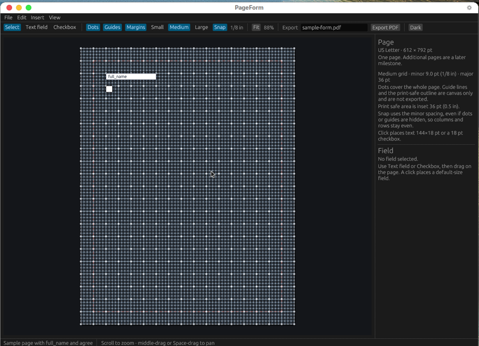

# PageForm

Free, open-source desktop app for designing fillable PDF forms. This milestone is one US Letter page (612 by 792 pt) with pan and zoom, a toggleable dot grid, and snap. Medium, the default grid, is 0.125 in minor and 0.5 in major. Small is 0.0625 in minor and 0.25 in major. Large is 0.25 in minor and 1 in major. Snap follows the active minor spacing, including when the dots are hidden, so columns and rows stay even. Guide lines and a 0.5 in print-safe outline can be shown on the canvas and are not written into the PDF. Export writes a fillable AcroForm file for the real fields. Windows and Linux only.

The window opens in the dark theme. A menu bar (File, Edit, Insert, View) sits above the toolbar. File exports the PDF path from the toolbar and quits. Edit selects or deletes the current item, and Preferences shows or hides the text beside radio buttons. Insert drops a default-sized item at the center of the visible page, snapped to the grid. The toolbar tools arm drawing on the canvas instead. View toggles grid dots, guide lines, the print-safe margin, a header band, a footer band, the page number, and snap, and chooses Small, Medium, or Large plus Dark or Light. Header, footer, and page numbers start off and stay on the canvas. The theme choice is restored the next time the app opens.

Insert, in order:

| Item | What it is |
| --- | --- |
| Text Field | One-line fillable AcroForm text field. |
| Text | Static one-line label. Page content, not a form field. |
| Checkbox | Fillable AcroForm checkbox. |
| Radio | AcroForm radio button. A selected radio makes the next one join that group (Yes, then No, then Option 3). Edit → Preferences → Radio labels hides the adjacent text. |
| Table | Placeholder. A 3 by 2 grid of lines. Cells are not editable. Not a form field. |
| Signature | Unsigned AcroForm signature field (`/FT /Sig`). The app does not capture ink or a picture. |
| Date | Fillable AcroForm text field, `/MaxLen 10`, alternate name `YYYY-MM-DD`, appearance hint `YYYY-MM-DD`, default appearance `/Helv 12 Tf 0 g`. Not a calendar popup. |
| Drop-down | AcroForm combo box with Yes, No, and Other. Not a list box. |
| Line | Stroke between two points. A menu click drops a horizontal line. Not a form field. |
| Square/Rectangle | Stroked rectangle. Not a form field. |
| Text Box | Static text block with basic wrapping. Not a form field. |
| Image | Placeholder box with a cross. Choosing a file is not available yet. Not a form field. |



## Build

Install stable Rust, then:

```bash
cargo run -p pageform
cargo test --workspace
cargo run -p pageform -- --export sample-form.pdf
```

Scroll to zoom. Middle-drag, or hold Space and drag, to pan. `cargo run -p pageform -- --demo` opens the sample fields used by the export test.

## License

MIT. See [LICENSE](LICENSE).
